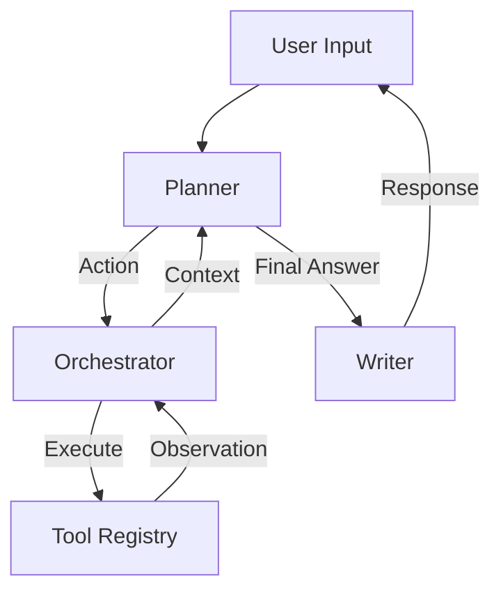

# Memora 🧠

<div align="center">


**A lightweight, extensible, and autonomous AI Agent framework.**

[English](README.md) | [简体中文](README_CN.md)

</div>

---

## ✨ Introduction

**Memora** is a next-generation AI Agent framework designed for developers who want to build autonomous systems that can *think* and *act*. Unlike traditional chatbots, Memora connects Large Language Models (LLMs) with the real world through a robust **Tool Registry** and an intelligent **Orchestrator**.

Whether you are running local models via **Ollama** or using state-of-the-art APIs like **GPT-4o**, **Gemini**, and **DeepSeek**, Memora provides a unified interface to turn prompts into executable actions.

## 🚀 Key Features

-   **🤖 Model Agnostic**: Seamlessly switch between OpenAI, Google Gemini, Aliyun Qwen, DeepSeek, and local Ollama models.
-   **🛠️ Powerful Tooling**: Built-in support for:
    -   **Shell Integration**: Execute system commands safely.
    -   **File Operations**: Native read/write support for Excel, Word, PowerPoint, JSON, and Images.
-   **🧠 ReAct Architecture**: Implements advanced Reason+Act loops for complex problem solving and autonomous execution.
-   **🔌 Extensible Design**: Modular architecture allows you to easily add new tools and LLM providers.
-   **💻 Dual Interface**: Ready-to-use CLI for developers and Web API for integrations.

## ⚡ Quick Start

### Prerequisites

-   Python 3.9+
-   Git

### Installation

1.  **Clone the repository**
    ```bash
    git clone git@github.com:yisenmoo/Memora.git
    cd Memora
    ```

2.  **Set up Virtual Environment**
    ```bash
    python -m venv venv
    source venv/bin/activate  # On Windows use `venv\Scripts\activate`
    ```

3.  **Install Dependencies**
    ```bash
    pip install -r requirements.txt
    ```

4.  **Configuration**
    Copy the example config and add your API keys:
    ```bash
    cp config.example.json config.json
    # Edit config.json with your preferred editor to add API keys
    ```

### 🏃‍♂️ Usage

**Command Line Interface (CLI)**

Interact with the agent directly in your terminal. The agent supports switching models on the fly.

```bash
python main.py
```

*Example Scenarios:*
> "Scan the 'data' directory for Excel files and summarize their contents."
> "Check the git status of this repo and create a new branch named 'feature/agent'."

## 🧩 Configuration

Memora supports a wide range of LLM backends. Configure them in `config.json`. We support environment variables expansion for security.

```json
{
  "llms": {
    "qwen3-local": {
      "provider": "ollama",
      "model": "qwen3:30b",
      "base_url": "http://localhost:11434",
      "stream": true
    },
    "gpt-4o": {
      "provider": "openai",
      "api_key": "${OPENAI_API_KEY}",
      "model": "gpt-4o"
    },
    "deepseek": {
      "provider": "goapi",
      "api_key": "${DEEPSEEK_API_KEY}",
      "model": "deepseek-chat"
    }
  }
}
```

## 🛠️ Architecture



## 🤝 Contributing

Contributions are welcome! Please feel free to submit a Pull Request.

## 📄 License

This project is licensed under the MIT License.
