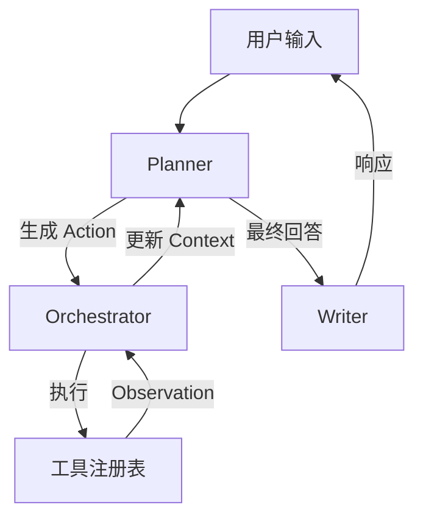

# Memora 🧠

<div align="center">


**一个轻量级、可扩展、自主决策的 AI Agent 框架**

[English](README.md) | [简体中文](README_CN.md)

</div>

---

## ✨ 简介

**Memora** 是为开发者打造的下一代 AI Agent 框架，旨在构建能够真正的“思考”和“行动”的自主系统。与传统的聊天机器人不同，Memora 通过强大的**工具注册表（Tool Registry）**和智能的**编排器（Orchestrator）**，将大语言模型（LLM）与现实世界连接起来。

无论您是运行本地的 **Ollama** 模型，还是使用 **GPT-4o**、**Gemini**、**DeepSeek** 等顶尖 API，Memora 都能提供统一的接口，将您的指令转化为实际行动。

## 🚀 核心特性

-   **🤖 模型无关 (Model Agnostic)**: 无缝切换 OpenAI, Google Gemini, 阿里云通义千问 (Qwen), DeepSeek 以及本地 Ollama 模型。
-   **🛠️ 强大的工具链**: 内置支持：
    -   **Shell 集成**: 安全地执行系统命令行。
    -   **文件操作**: 原生支持读取/写入 Excel, Word, PowerPoint, JSON 以及图片信息。
-   **🧠 ReAct 架构**: 实现先进的 Reason+Act 循环，支持复杂问题的拆解与自主执行。
-   **🔌 易于扩展**: 模块化设计，轻松添加新的自定义工具和 LLM 提供商。
-   **💻 双重接口**: 提供面向开发者的 CLI 命令行界面和面向集成的 Web API。

## ⚡ 快速开始

### 前置要求

-   Python 3.9+
-   Git

### 安装步骤

1.  **克隆仓库**
    ```bash
    git clone git@github.com:yisenmoo/Memora.git
    cd Memora
    ```

2.  **设置虚拟环境**
    ```bash
    python -m venv venv
    source venv/bin/activate  # Windows 用户使用 `venv\Scripts\activate`
    ```

3.  **安装依赖**
    ```bash
    pip install -r requirements.txt
    ```

4.  **配置**
    复制示例配置并填入您的 API Key：
    ```bash
    cp config.example.json config.json
    # 使用您喜欢的编辑器编辑 config.json
    ```

### 🏃‍♂️ 使用方法

**命令行界面 (CLI)**

直接在终端与 Agent 交互。支持运行时动态切换模型。

```bash
python main.py
```

*场景示例:*
> "扫描 'data' 目录下的 Excel 文件并总结其内容。"
> "检查当前仓库的 git 状态，并创建一个名为 'feature/agent' 的新分支。"

## 🧩 配置说明

Memora 支持多种 LLM 后端。请在 `config.json` 中配置。为了安全起见，我们支持使用环境变量引用（如 `${VAR_NAME}`）。

```json
{
  "llms": {
    "qwen3-local": {
      "provider": "ollama",
      "model": "qwen3:30b",
      "base_url": "http://localhost:11434",
      "stream": true
    },
    "gpt-4o": {
      "provider": "openai",
      "api_key": "${OPENAI_API_KEY}",
      "model": "gpt-4o"
    },
    "deepseek": {
      "provider": "goapi",
      "api_key": "${DEEPSEEK_API_KEY}",
      "model": "deepseek-chat"
    }
  }
}
```

## 🛠️ 架构设计



## 🤝 贡献指南

欢迎贡献代码！请随时提交 Pull Request。

## 📄 许可证

本项目基于 Apache License 2.0 许可证开源。
